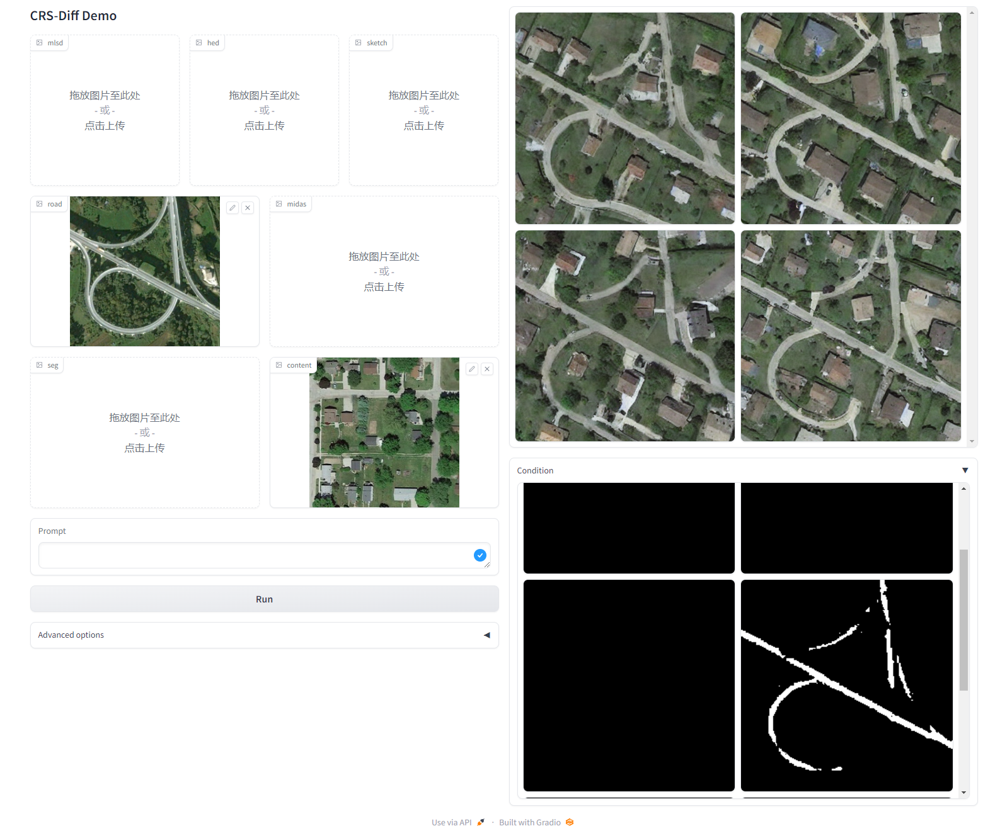

# CRS-Diff: Controllable Generative Remote Sensing Foundation Model
### [Paper (ArXiv)](https://arxiv.org/abs/2403.11614) 


<div align=center>

</div>

## TODO

- [x] Release inference code.
- [x] Release pretrained models.
- [x] Release Gradio UI.
- [ ] Release training code

## Environment

```bash
conda env create -f environment.yaml
conda activate csrldm
```
You can download pre-trained models [last.ckpt](https://drive.google.com/file/d/1CJZ9CG_ssQBeww1enVoEzCyelimxPiaW/view?usp=drive_link) and put it to `./ckpt/` folder.

### Testing

You can run the code to start the gradio interface by:
```bash
python src/test/test.py
```
The demonstration effects of the project are as follows:
<div align=center>

</div>

You can also use the following code to generate images more quickly
```bash
python src/test/inference.py
```
Some of the results are shown below：
<div align=center>

</div>

## Acknowledgments:

This repo is built upon [ControlNet](https://github.com/lllyasviel/ControlNet/tree/main) and [Uni-ControlNet](https://github.com/ShihaoZhaoZSH/Uni-ControlNet/tree/main). 
Some of the functional implementations of remote sensing imagery refer to: [GeoSeg](https://github.com/WangLibo1995/GeoSeg) and [SGCN](https://github.com/tist0bsc/SGCN) Sincere thanks to their excellent work!

## Citation
```
@misc{tang2024crsdiff,
      title={CRS-Diff: Controllable Generative Remote Sensing Foundation Model}, 
      author={Datao Tang and Xiangyong Cao and Xingsong Hou and Zhongyuan Jiang and Deyu Meng},
      year={2024},
      eprint={2403.11614},
      archivePrefix={arXiv},
      primaryClass={cs.CV}
}
```
